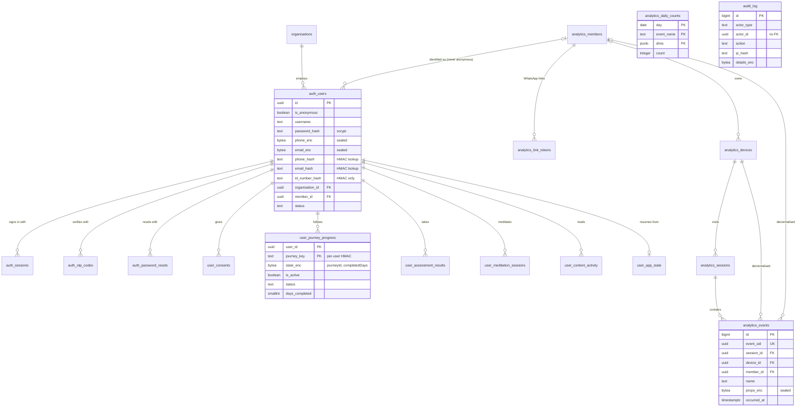

# AskNelson database design — accounts, progress, event tracking

PostgreSQL 16. The schema is created and upgraded by the migrations in
`server/db.js` (001, 002) and `server/migrations/003_popia_encryption.js`,
applied automatically at boot. `docs/schema.sql` is the resulting DDL, dumped
from a migrated database with `pg_dump --schema-only` — regenerate it after any
new migration rather than editing it by hand.

Contents: [overview](#overview) · [ERD](#entity-relationship-diagram) ·
[tables](#tables) · [encryption](#encryption-at-rest) ·
[transport](#encryption-in-transit) · [event tracking](#event-tracking) ·
[progress](#progress-continue-where-you-left-off) ·
[POPIA](#popia-mapping) · [operations](#operations) ·
[external content](#external-content-in-app)

---

## Overview

Four groups of tables:

| Group | Tables | Purpose |
| ----- | ------ | ------- |
| **Identity** | `organisations`, `auth_users`, `auth_sessions`, `auth_otp_codes`, `auth_password_resets`, `user_consents` | Sign-up (Figma flow), sign-in, OTP verification, password reset, POPIA consent |
| **Progress** | `user_journey_progress`, `user_assessment_results`, `user_meditation_sessions`, `user_content_activity`, `user_app_state` | "Continue where you left off", on any device |
| **Analytics** | `analytics_members`, `analytics_link_tokens`, `analytics_devices`, `analytics_sessions`, `analytics_events`, `analytics_daily_counts` | Every user event, tied to device → session → (optional) member |
| **Accountability** | `audit_log`, `_analytics_migrations` | Security audit trail; migration bookkeeping |

Design rules the schema follows:

1. **Nothing personal is stored in plaintext.** Contact details, names, event
   props, paths, referrers, user agents, progress items and member references
   are sealed with AES-256-GCM in the application before they reach Postgres.
2. **Lookups use keyed hashes, never the value.** Phone, email and ID number
   are found by an HMAC (`*_hash` columns); the ID number itself is never
   stored at all.
3. **Health information is hidden even from the database's structure.** Which
   journey or assessment a row belongs to is sealed, and rows are addressed by
   a *per-user* blind index — the database can't tell which journey a row is,
   nor that two people are on the same one.
4. **Reporting runs on de-identified aggregates.** `analytics_daily_counts`
   holds counts with no device, session or member ids, and outlives the raw
   events.
5. **The database enforces the promises.** Anonymous accounts can't carry a
   member link (CHECK constraint); one active journey per person (partial
   unique index); deletes cascade from the account to all its data.

---

## Entity-relationship diagram



`audit_log` and `analytics_daily_counts` deliberately have no foreign keys:
the audit trail must survive an account's deletion, and the counts contain no
ids to link.

---

## Tables

Legend — **S** sealed (AES-256-GCM, `bytea`), **H** keyed hash (HMAC-SHA256),
**P** plain. Class — *SPI* special personal information (POPIA s26: health),
*PI* personal information, *pseud.* pseudonymous id, *—* not personal.

### Identity

**`organisations`** — employers, de-duplicated on `name_key` (lower-cased,
whitespace-collapsed). A company name is not personal information on its own,
and a plain FK lets per-employer EAP reporting run without decrypting users.

**`auth_users`** — one row per account.

| Column | Prot. | Class | Notes |
| ------ | ----- | ----- | ----- |
| `id` | P | pseud. | UUID |
| `is_anonymous` | P | — | Anonymous accounts: API only, not in the current Figma flow |
| `username` | P | pseud. | Anonymous accounts only (a chosen pseudonym) |
| `password_hash` | scrypt | — | N=2¹⁵, r=8, p=1, per-user salt |
| `phone_enc`, `email_enc` | S | PI | Erased (NULL) at verification for anonymous accounts |
| `first_name_enc`, `last_name_enc`, `employee_no_enc` | S | PI | Optional; not collected by the Figma sign-up |
| `phone_hash`, `email_hash` | H | PI | Sign-in and duplicate detection (unique) |
| `id_number_hash` | H | PI | Duplicate detection only; **the ID number is never stored** |
| `organisation_id` | P | — | → `organisations` |
| `member_id` | P | pseud. | → `analytics_members`; NULL-forced for anonymous rows |
| `status` | P | — | `pending` → `active` (→ `disabled`) |
| `failed_logins`, `locked_until` | P | — | 8 failures → 15-minute lock |
| `created_at`, `verified_at`, `last_login_at`, `password_changed_at` | P | — | |

`CHECK auth_users_anon_unlinked_chk`: an anonymous row can never carry a member
link, a name, or an ID hash.

**`auth_sessions`** — `token_hash` (SHA-256 of the httpOnly cookie token; the
token itself is never stored), `persistent` ("Remember me": 30 days rolling;
unticked: browser-session cookie, 12 hours), `user_agent_enc` (S), `expires_at`,
`revoked_at`. A password reset revokes every session.

**`auth_otp_codes`** — `code_hash` (SHA-256), `channel`, `destination_masked`
(e.g. `•••• •••567` — the real number is not kept here), 10-minute expiry,
5 attempts, single use, superseded on resend.

**`auth_password_resets`** — `token_hash`, `channel`, `destination_masked`,
30-minute expiry, `consumed_at`. Only the newest link works; using one consumes
all outstanding links.

**`user_consents`** — append-only: `purpose` (`privacy_notice`,
`health_information`), `notice_version`, `granted`, `source`, `recorded_at`.
Withdrawal is a new row with `granted = false`, so what was agreed to, and
when, is always provable.

### Progress

Written by `/api/progress` (`server/progress.js`); read back as one snapshot
shaped like the app's localStorage, so the client hydrates by writing it
straight back.

| Table | Key | Sealed payload | Plain columns (non-revealing) |
| ----- | --- | -------------- | ----------------------------- |
| `user_journey_progress` | `(user_id, journey_key)` | `state_enc`: `{ journeyId, completedDays[] }` | `is_active`, `status`, `days_completed`, `total_days`, `started_at`, `last_activity_at`, `completed_at` |
| `user_assessment_results` | `id`; unique `(user_id, assessment_key, taken_at)` | `result_enc`: `{ assessmentId, score, band }` | `taken_at` |
| `user_meditation_sessions` | `id` | — (not health information) | `planned_sec`, `elapsed_sec`, `sound`, `completed`, `ended_at` |
| `user_content_activity` | `(user_id, content_key)` | `content_enc`: `{ contentId, title, url, themeId, type }` | `open_count`, `first_opened_at`, `last_opened_at` |
| `user_app_state` | `user_id` | `last_route_enc`, `preferences_enc` | `updated_at` |

`journey_key` / `assessment_key` / `content_key` = HMAC(pepper,
`<namespace>\0<user id>:<item id>`). Per-user, so equal keys never appear across
users and frequency analysis can't reveal "most people are on the anxiety
journey".

Raw assessment answers are **never** stored — not here, not in localStorage,
not in analytics. That includes the PHQ-9 self-harm item.

### Analytics

| Table | One row per | Sealed | Plain |
| ----- | ----------- | ------ | ----- |
| `analytics_members` | person known to the EAP (staff no., CRM id, or `user:<id>`) | `external_ref_enc`, `label_enc` | `external_ref_hash` (unique lookup) |
| `analytics_link_tokens` | WhatsApp link | `label_enc` | `token_hash`, usage counters |
| `analytics_devices` | browser profile | `user_agent_enc`, `first_referrer_enc`, `first_landing_path_enc`, `first_utm_enc` | platform, language, timezone, screen, display mode, counts |
| `analytics_sessions` | visit (30-min idle) | `entry_path_enc`, `referrer_enc`, `utm_enc`, `user_agent_enc` | source, display mode, timestamps, counts |
| `analytics_events` | tracked action | `path_enc`, `props_enc` | `name`, `category`, `occurred_at`, ids, `client_seq` |
| `analytics_daily_counts` | (day, event, dims) | — | de-identified counts, **no ids** |

Event names, categories, ids and timestamps stay in the clear so the admin
overview can count, group and order without decrypting anything. `device_id`
and `member_id` are denormalised onto every event so "everything this person
did" needs no join. IP addresses are never stored in analytics.

### Accountability

**`audit_log`** — `actor_type` (`user`/`admin`/`system`/`anonymous`),
`actor_id` (no FK), `action`, `target_type`, `target_id`, `ip_hash` (keyed),
`details_enc` (S). Recorded actions: `registration_started`,
`registration_verified`, `login_succeeded`, `login_failed`,
`password_reset_requested`, `password_reset_completed`, `data_exported`,
`account_deleted`, `admin_viewed_device`, `admin_exported_events`,
`admin_minted_link`.

---

## Encryption at rest

Implemented in `server/crypto.js`.

- **Algorithm**: AES-256-GCM (authenticated). Fresh 96-bit IV per value.
- **Layout** (`bytea`): `[format=1][key id][12-byte IV][16-byte tag][ciphertext]`.
- **Context binding**: every value is sealed with GCM additional authenticated
  data naming its home, e.g. `auth_users.phone:<user id>`. A ciphertext copied
  to another row or column fails to decrypt rather than showing the wrong
  person's data. (Verified: an email ciphertext opened under the phone
  column's context is rejected.)
- **Keys**: `DATA_ENCRYPTION_KEYS="<id>:<base64 32 bytes>,…"`, newest first.
  New writes use the first key; any listed key can decrypt. Generate with
  `npm run keys:generate`. The server refuses to start with a database but no
  key.
- **Why not pgcrypto**: `pgp_sym_encrypt(value, key)` sends the key to the
  database in every statement, where `log_statement`, `pg_stat_statements` or
  a replica could capture it. Here the database never sees a key or plaintext.
- **Blind indexes**: HMAC-SHA256 keyed with `AUTH_PEPPER`. Contact hashes keep
  the original un-namespaced scheme so accounts created before encryption still
  sign in.

**Key rotation**: generate id 2, set `DATA_ENCRYPTION_KEYS=2:<new>,1:<old>`,
redeploy. New and updated rows use key 2. Re-encrypting old rows in bulk (then
dropping key 1) is a follow-up script — not written yet.

**Disk and backups**: application encryption protects the columns; also enable
storage encryption on the Postgres volume and its backups (managed Postgres
does this by default — e.g. AWS RDS / Azure in a South African region).

---

## Encryption in transit

| Hop | Control |
| --- | ------- |
| Browser → app | TLS at the load balancer / ingress. `FORCE_HTTPS=true` redirects HTTP → HTTPS; `Strict-Transport-Security` on every HTTPS response; cookies `Secure` + `httpOnly` (session) + `SameSite=Lax` |
| App → Postgres | `DATABASE_SSL=verify-full` (+ `DATABASE_SSL_CA_FILE`): TLS with certificate verification. `require` encrypts without verifying (warned at boot); `disable` only for compose's private network |
| App → SMS/email providers | HTTPS APIs (Twilio, SendGrid, webhook) |
| App → external sites | Embed checks over HTTPS only |

Also sent: `Referrer-Policy: strict-origin-when-cross-origin` (in-app URLs such
as `?journey=grief` never leak to external sites), `X-Frame-Options: SAMEORIGIN`,
`X-Content-Type-Options: nosniff`, and `Cache-Control: no-store` on every
auth and progress response.

---

## Event tracking

### What's needed, and where it lives

| Piece | Implementation |
| ----- | -------------- |
| Client tracker — queue, batch, offline, retry | `src/lib/analytics.js` (`track(name, props)`) |
| Identity — device → session → member | device id in localStorage + `an_did` cookie; 30-min sessions; member via WhatsApp `?t=` token or identified sign-in |
| Ingest API — idempotent on `event_uid` | `POST /api/analytics/session`, `POST /api/analytics/events` |
| Encrypted storage | `analytics_*` tables, props/paths sealed |
| De-identified reporting | `analytics_daily_counts`, updated at ingest |
| Admin reporting + CSV | `/api/analytics/admin/*` (decrypts; views and exports audited) |
| Retention | daily sweep: raw events/sessions/devices after `ANALYTICS_RETENTION_DAYS` (730) |
| Consent + notice | `user_consents`; `PRIVACY_NOTICE_VERSION` |

### Event catalogue

| Category | Events (props) |
| -------- | -------------- |
| session | `session_start` (source, display_mode, linked), `session_end` (reason) |
| navigation | `page_view` (path) |
| lifecycle | `app_installed`, `connectivity_change` (online) |
| auth | `registration_started`, `registration_step_completed` (step), `registration_otp_sent` (channel), `registration_otp_resent`, `registration_verification_failed`, `registered` (anonymous), `signed_in` (anonymous, remember), `sign_in_failed` (status), `signed_out`, `password_reset_requested` (channel), `password_reset_completed` |
| content | `content_opened` (id, title, theme, type, source), `theme_filtered` (theme, label), `external_opened` (host, mode: embed/video/blocked, content_id, type), `external_closed` (host, mode, seconds), `external_opened_outside` (host, from) |
| journey | `journey_started`, `journey_switched`, `journey_day_completed` (journey, day, type, completed, total), `journey_completed`, `journey_resource_opened` |
| assessment | `assessment_started`, `assessment_completed` (score, band, safety_triggered), `assessment_abandoned` (answered, questions) |
| meditation | `meditation_started`, `meditation_completed`, `meditation_stopped` (elapsed_sec) |
| support | `sos_pressed`, `booking_clicked` (service) |
| progress | `progress_restored` (journeys, assessments) |

New events need no server change (unknown names are filed as `custom`). Never
put free text a member typed, or raw assessment answers, into props.

Rollup dimensions (`server/rollups.js`) — only low-cardinality, non-identifying
props: content title/theme/type, embed host/mode, journey id, assessment id +
band, meditation duration/sound, booking service.

---

## Progress: continue where you left off

- The UI keeps rendering from localStorage (instant, offline, and unchanged for
  signed-out visitors).
- Signed in, each change is also queued in a persisted outbox
  (`src/lib/progressSync.js`) and sent to `/api/progress` in order, retried
  with backoff when offline.
- At sign-in (and on every app load with a session) the device's local
  progress is **merged** into the account: days unioned, earliest start date
  kept, results de-duplicated by timestamp; the account's active journey wins.
  The merged snapshot replaces local storage.
- After sign-in the member lands on `app.lastRoute` — the last screen they used,
  on any device.
- On sign-out, local progress is wiped (shared phones).

| Endpoint | Does |
| -------- | ---- |
| `GET /api/progress` | full snapshot |
| `POST /api/progress/merge` | fold device progress into the account, return snapshot |
| `PUT /api/progress/journeys/:id` | start / restart / replace a journey |
| `POST /api/progress/journeys/:id/days` | mark a day done (idempotent) |
| `PUT /api/progress/active-journey` | switch or clear the active journey |
| `POST /api/progress/assessments/:id/results` | record a score + band |
| `POST /api/progress/meditation` | record a session (and last settings) |
| `POST /api/progress/content/opened` | recently opened content |
| `PUT /api/progress/app-state` | last route |

Deliberately not resumable: a half-finished assessment. Resuming would mean
storing raw answers (including the self-harm item), which this app never does.

---

## POPIA mapping

| POPIA | Requirement | In this codebase | Still needed (organisational) |
| ----- | ----------- | ---------------- | ----------------------------- |
| s8 Accountability | Responsible party ensures compliance | Audit log; this document | Register the Information Officer with the Information Regulator |
| s10 Minimality | Adequate, relevant, not excessive | ID number never stored (hash only); no IPs in analytics; anonymous accounts erase contacts | Review whether ID number is needed at all |
| s11, s27(1)(a) Consent | Lawful basis; explicit consent for health info | Consent checkbox at sign-up; `user_consents` with notice version | Publish the privacy notice the checkbox refers to |
| s13–14 Purpose & retention | Specific purpose; keep no longer than necessary | Retention sweep (events 2 yrs, audit 5 yrs, pending sign-ups 24 h, codes/links 1 day); aggregates de-identified | Confirm the periods with legal |
| s18 Notification | Tell the data subject what's collected | Consent copy on sign-up | Privacy notice + in-app link |
| s19 Security safeguards | Appropriate technical measures | AES-256-GCM at rest with context binding; TLS to DB (`verify-full`); HSTS; hashed tokens/codes/passwords; lockout; rate limits; `no-store` | Disk/backup encryption; key custody in a secrets manager; access control to admin; penetration test |
| s20–21 Operators | Written agreements with processors | — | Operator agreements with hosting, Twilio/SendGrid/Kaelo |
| s22 Breach notification | Notify Regulator and subjects | Audit log supports investigation | Incident response plan |
| s23 Access | Data subject may obtain their data | `GET /api/auth/me/export` (decrypted JSON: account, consents, sessions, progress, activity) | A screen for it (not in Figma) |
| s24 Correction/deletion | Correct or delete | `POST /api/auth/me/delete` erases account, progress, consents, member, linked devices and their events | Profile-edit screen; a screen for delete |
| s26–27 Special personal info | Health data restrictions | Assessment/journey data sealed and blind-indexed; consent recorded | DPIA (recommended) |
| s72 Cross-border | Transfers outside SA | — | Host Postgres and backups in a South African region, or document adequacy |

---

## Operations

**Upgrading an existing database** (with real data): migration 003 seals all
existing rows, drops the plaintext columns and runs `VACUUM FULL` on the
affected tables, so the old values are physically removed from the table files
(verified by searching the data directory). **But the write-ahead log and any
backup taken before the upgrade still contain plaintext.** After upgrading:
take a fresh base backup, then delete older backups and archived WAL.

**Querying sealed data**: use the admin console or the API — `psql` shows
`bytea`. De-identified numbers need no key:

```sql
-- Most-opened articles over 30 days (no personal data involved).
SELECT dims->>'title' AS title, sum(count) AS opens
  FROM analytics_daily_counts
 WHERE event_name = 'content_opened' AND dims ? 'title'
   AND day > current_date - 30
 GROUP BY 1 ORDER BY 2 DESC LIMIT 10;

-- Journey completions per employer, without decrypting a single row.
SELECT o.name, count(*) FILTER (WHERE j.status = 'completed') AS completed,
       count(*) AS started
  FROM user_journey_progress j
  JOIN auth_users u ON u.id = j.user_id
  JOIN organisations o ON o.id = u.organisation_id
 GROUP BY 1;

-- Security: failed sign-ins in the last day.
SELECT date_trunc('hour', occurred_at), count(*)
  FROM audit_log WHERE action = 'login_failed'
   AND occurred_at > now() - interval '1 day'
 GROUP BY 1 ORDER BY 1;
```

**Least privilege** (recommended): run the app as a role with DML on these
tables only (no `CREATE`/`DROP` outside migrations), and give analysts a
read-only role limited to `analytics_daily_counts` and `organisations`.

---

## External content in-app

Can the external URLs render inside the app? **Partly — the publisher decides.**
Browsers enforce each site's `X-Frame-Options` / CSP `frame-ancestors` on
iframes, and no client-side code can override it.

Survey of the 39 hosts linked from `explore.json` / `journeys.json`
(118 URLs), September 2026:

- **Videos (YouTube, TED talks)**: the watch pages block framing, but both
  providers' embed players are built for it. Rewritten automatically to
  `youtube-nocookie.com/embed/…` and `embed.ted.com/talks/…` — play in-app.
- **Allow framing (17 hosts)**, shown in-app: e.g. sleepfoundation.org,
  greatergood.berkeley.edu, healthline.com, hbr.org, psychcentral.com,
  grief.com, stress.org, and the Kaelo booking form.
- **Block framing (22 hosts)**, e.g. nhs.uk, mind.org.uk, psychologytoday.com,
  verywellmind.com, mayoclinic.org, calm.com, theconversation.com,
  ed.ted.com lessons. For these the viewer explains and offers "Open in
  browser"; in the installed PWA that opens as an in-app browser tab over
  AskNelson (Android Custom Tab / iOS Safari view).

How it works: `src/components/InAppBrowser.jsx` opens as a history entry (back
closes it); `GET /api/embed/check?url=` reads the target's headers once
(cached 12 h), allowing only hosts that appear in the app's content (SSRF
guard: https only, private addresses refused at every redirect hop).

The only way to show the blocked articles inside the app is to host the text
ourselves — licence it from the publisher, or commission equivalent articles.
Scraping and re-rendering (a "reader proxy") would breach the publishers'
terms and copyright, and is not implemented.
